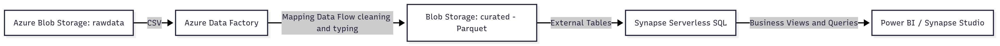

# Azure Data Engineering Portfolio

## 🌍 About this Repository
This repository showcases practical **Data Engineering projects on Microsoft Azure**, designed as a portfolio for recruiters and hiring managers.  
It includes **end-to-end pipelines, documentation, SQL scripts, and architecture diagrams** to demonstrate hands-on experience with Azure services.

---

## 🚀 Projects

### 1. Azure Data Factory Portfolio Project
End-to-end **Azure Data Engineering solution** integrating **Azure Data Factory, Databricks, SQL, and Key Vault**, following a realistic production-style design.  
This project demonstrates **data ingestion, enrichment, orchestration, and gold-layer publishing**, with full documentation and deployment assets.  

👉 [Explore the project](projects/adf-portfolio/)

---

### 2. ETL with Azure Data Factory & Synapse Serverless
- **Ingest** raw CSV files from Azure Blob Storage (`rawdata` container).  
- **Transform** data using Azure Data Factory (Mapping Data Flows).  
- **Store** cleansed data as Parquet files in the `curated` container.  
- **Migrate** curated outputs to **ADLS Gen2** to enable Synapse external tables (classic Blob storage does not support hierarchical namespace).  
- **Expose** curated data with **Synapse serverless external tables** and business views.  

👉 [See detailed documentation](project1-adf-synapse/docs/README.md)

#### Storage Zones
Created three containers to support the raw → curated → gold architecture:
- **rawdata** → raw CSV files.  
- **curated** → cleansed Parquet data.  
- **gold** → aggregated/analytical data.  

#### 📊 Project 1 Architecture
End-to-end pipeline overview:

👉 [Explore Project 1](project1-adf-synapse/docs/README.md)

---

### 3. Mini Lakehouse with Databricks & Delta Lake
- **Ingest** data into a Bronze Delta table.  
- **Transform** into Silver and Gold layers with Databricks notebooks.  
- **Enable** analytics with Databricks SQL and/or Synapse serverless.  
- **Focus** on Delta Lake best practices, schema evolution, and partitioning.  

👉 *(Coming soon)*

---

## 🛠️ Technologies Used
- **Azure Data Factory** – Orchestration & ETL  
- **Azure Synapse (Serverless SQL)** – Data exposure & analytics  
- **Azure Blob Storage / ADLS Gen2** – Data lake zones (raw, curated, gold)  
- **Azure Databricks + Delta Lake** – Lakehouse architecture  
- **Power BI (optional)** – Reporting & dashboards  

---

## 📸 Portfolio Artifacts
Each project includes:
- **Architecture diagrams** (Mermaid/draw.io/PNG)  
- **Screenshots** of Azure resources and pipelines  
- **SQL scripts** for Synapse integration (`/docs/sql/`)  
- **Documentation** for reproducibility  

---

## 👨‍💻 Author
Built by **Ruben Kaplan** – Data Engineer with hands-on experience in Azure Data Factory, Synapse, Databricks, and Delta Lake.  
Open to remote opportunities in English-speaking environments.  

---

## 📌 Notes
This portfolio was developed using an **Azure free trial subscription**, optimized for **low cost** and **quick deployment**.  
Some pipelines were first prototyped on **classic Blob Storage** and later **migrated to ADLS Gen2** to support Synapse external tables. This demonstrates awareness of **Azure service limitations** and practical problem-solving in data engineering.
