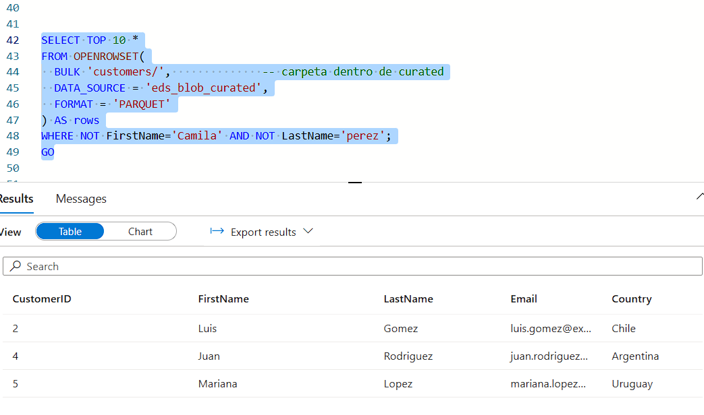

# Project 1 – ETL with Azure Data Factory & Synapse Serverless

## 📌 Overview
This project demonstrates an end-to-end ETL pipeline using **Azure Data Factory (ADF)** and **Azure Synapse Analytics Serverless SQL Pool**, following a lakehouse-style architecture.  

The workflow starts with CSV data stored in Azure Blob Storage (classic), transformed into Parquet files with ADF, and then **manually migrated** to **Azure Data Lake Storage Gen2** to enable Synapse Serverless external tables (due to Hierarchical Namespace requirements).  

The curated data is queried via external tables in Synapse and prepared for analytics.

---

## 🏗 Architecture


- **Raw Zone**: CSV files (`customers.csv`, `orders.csv`) in Blob Storage (classic).
- **Curated Zone**: Data transformed to Parquet format using ADF pipelines.
- **Migration Step**: Curated Parquet files were manually copied to ADLS Gen2 using Azure Storage Explorer.
- **Analytics Layer**: Synapse Serverless external tables over ADLS Gen2 curated zone for reporting and analysis.

---

## 📂 Storage Setup

- Containers created: `rawdata/`, `curated/`, `gold/`
- Source files uploaded to `rawdata/`: `customers.csv`, `orders.csv`


Screenshots:

  
  

---

## ⚙️ Azure Data Factory (ADF)

### Linked Services
- **Azure Blob Storage (classic)** – used for raw and curated zones.
- **Integration Runtime** – AutoResolve.

### Datasets
- `ds_customers_raw` → CSV (raw).  
- `ds_customers_curated` → Parquet (curated).  
- `ds_orders_raw` → CSV (raw).  
- `ds_orders_curated` → Parquet (curated).  

### Pipeline
- **Copy Activity** to move CSV → Parquet.  
- Data types casted and cleaned using Mapping Data Flow.  

Screenshot:  


---

## 🗄 Azure Synapse Serverless

After manual migration of Parquet files to **ADLS Gen2 (with Hierarchical Namespace)**, Synapse can connect via **Managed Identity**.

### 1. Create Database
```sql
CREATE DATABASE demo_portfolio;
GO
```

### 2. External Data Source
```sql
CREATE EXTERNAL DATA SOURCE eds_adls_synapse
WITH (
    LOCATION = 'abfss://curated@<your-storage-account>.dfs.core.windows.net'
);
GO
```

### 3. External File Format
```sql
CREATE EXTERNAL FILE FORMAT eff_parquet
WITH (FORMAT_TYPE = PARQUET);
GO
```

### 4. External Schema & Tables
```sql
CREATE SCHEMA curated;
GO

CREATE EXTERNAL TABLE curated.customers (
    CustomerID NVARCHAR(50),
    Name NVARCHAR(100),
    Country NVARCHAR(50)
)
WITH (
    LOCATION = '/customers/',
    DATA_SOURCE = eds_adls_synapse,
    FILE_FORMAT = eff_parquet
);
GO

CREATE EXTERNAL TABLE curated.orders (
    OrderID INT,
    CustomerID NVARCHAR(50),
    Amount FLOAT
)
WITH (
    LOCATION = '/orders/',
    DATA_SOURCE = eds_adls_synapse,
    FILE_FORMAT = eff_parquet
);
GO
```

### 5. Validation Queries
```sql
SELECT TOP 10 * FROM curated.customers;
SELECT TOP 10 * FROM curated.orders;
```

Screenshots:  
  


---

## ✅ Lessons Learned

- **Classic Blob Storage limitation**: Synapse Serverless cannot create external tables without **Hierarchical Namespace**.  
- **Workaround**: Curated Parquet files were **manually migrated** to ADLS Gen2 using Azure Storage Explorer.  
- **Schema bug fixed**: `CustomerID` was incorrectly defined as `INT` in the external table. Corrected to `NVARCHAR(50)` to match the Parquet schema.  
- This highlights a **real-world architectural evolution**: starting fast with Blob Storage, then migrating to ADLS Gen2 to unlock full analytics capabilities.

---

## 🔮 Next Steps
- Extend ADF pipeline to process `orders.csv`.  
- Create **gold views** with typed business metrics.  
- Connect Power BI for reporting.

---

## 📂 Repository Structure
```
/docs
  ├── README.md              # Detailed documentation (this file)
  ├── images/                # Screenshots
  └── sql/                   # SQL scripts
      ├── 01_synapse_setup.sql
      └── 02_external_tables_and_views.sql
/README.md                   # Short summary for project root
```
