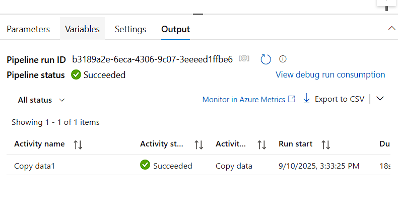
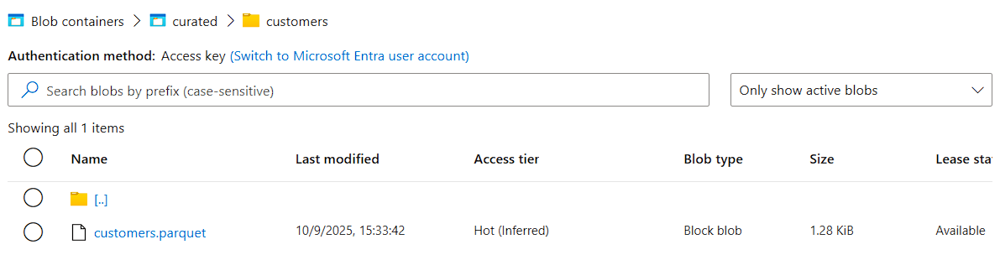
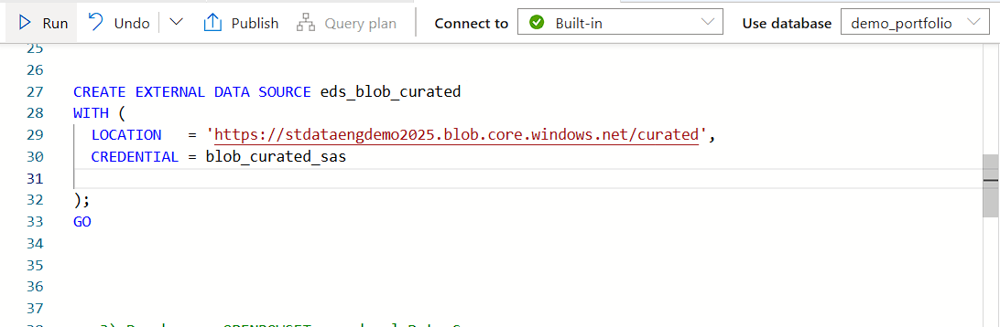

# Project 1 – ETL with Azure Data Factory & Synapse Serverless

## 📌 Overview
This project demonstrates a simple but professional **ETL pipeline in Azure**:
- **Extract**: Raw CSV files from Azure Blob Storage (`rawdata`).
- **Transform**: Data copied and converted into **Parquet** format.
- **Load**: Curated data exposed in Azure Synapse Serverless for analytics.

The goal is to show best practices in **data pipelines** using Azure services.

---

## 🏗️ Architecture
The pipeline follows a **raw → curated → analytics** approach.

---

## 🔹 Steps Implemented
1. **Storage setup**
   - Created three containers: `rawdata`, `curated`, `gold`.
   - Uploaded source files: `customers.csv`, `orders.csv`.

2. **ADF Datasets**
   - `ds_customers_raw` → input (CSV).
   - `ds_customers_curated` → output (Parquet).
   - (Later: `ds_orders_raw`, `ds_orders_curated`).

3. **Pipeline**
   - `pl_copy_customers_raw_to_curated`
   - Copy Activity from CSV → Parquet.
   - Debug & Trigger execution tested.

4. **Results**
   - Pipeline run succeeded ✅
   - Parquet file created in `curated/customers/`.

5. **Synapse Connection (secure)**
   - Created a **Database Master Key**.
   - Configured a **Database Scoped Credential** with a SAS token.
   - Defined an **External Data Source** pointing to the `curated` container.
   - Verified access with `OPENROWSET` queries on `customers` and `orders`.

---

## 📸 Screenshots
- Azure Blob Storage containers  
  

- ADF Dataset Preview (`customers.csv`)  
  

- ADF Pipeline execution (Succeeded)  
  

- Parquet file in `curated/customers/`  
  

- Synapse External Data Source creation  
  

- Synapse query over `customers` (TOP 10 rows)  
  

---

## ✅ Next Steps
- Add `orders` pipeline and Parquet.
- Create **External Tables** (`ext_customers`, `ext_orders`).
- Build **business views** (e.g., sales by customer, sales by country).
- Document results with screenshots and SQL scripts.
