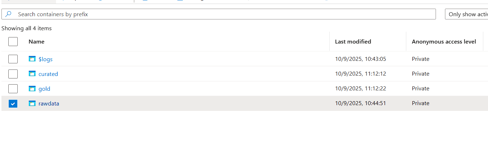
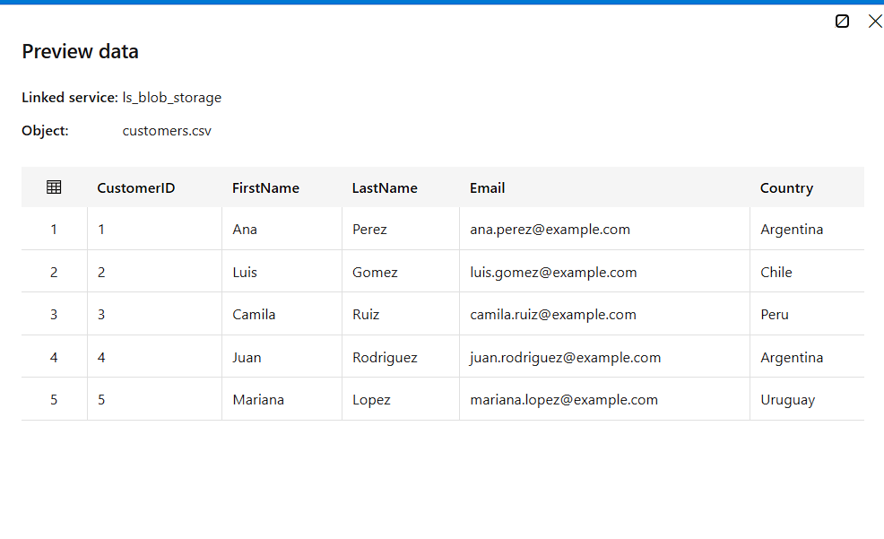
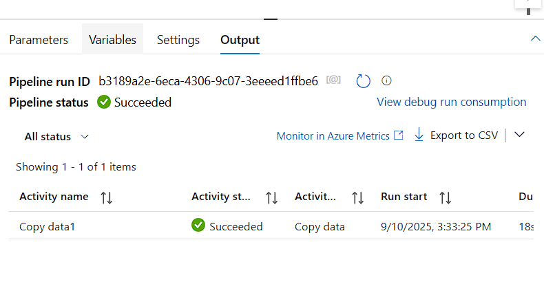
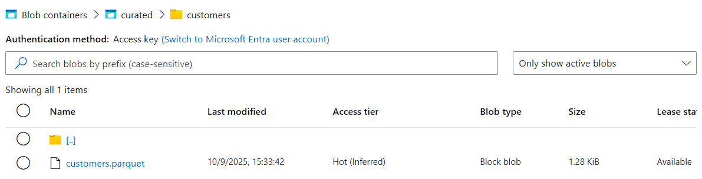

# Project 1 – ETL with Azure Data Factory & Synapse Serverless

## 📌 Overview
This project demonstrates a simple but professional **ETL pipeline in Azure**:
- **Extract**: Raw CSV files from Azure Blob Storage (`rawdata`).
- **Transform**: Data copied and converted into **Parquet** format.
- **Load**: Curated data exposed in Azure Synapse Serverless for analytics.

The goal is to show best practices in **data pipelines** using Azure services.

---

## 🏗️ Architecture
The pipeline follows a **raw → curated → analytics** approach.

---

## 🔹 Steps Implemented
1. **Storage setup**
   - Created three containers: `rawdata`, `curated`, `gold`.
   - Uploaded source files: `customers.csv`, `orders.csv`.

2. **ADF Datasets**
   - `ds_customers_raw` → input (CSV).
   - `ds_customers_curated` → output (Parquet).
   - (Later: `ds_orders_raw`, `ds_orders_curated`).

3. **Pipeline**
   - `pl_copy_customers_raw_to_curated`
   - Copy Activity from CSV → Parquet.
   - Debug & Trigger execution tested.

4. **Results**
   - Pipeline run succeeded ✅
   - Parquet file created in `curated/customers/`.

---

## 📸 Screenshots
- Azure Blob Storage containers  
  

- ADF Dataset Preview (`customers.csv`)  
  

- ADF Pipeline execution (Succeeded)  
  

- Parquet file in `curated/customers/`  
  

---

## 📌 Notes: Why Parquet format?
- **Efficient storage** → compressed, smaller than CSV.  
- **Schema & types** → preserves int, string, decimal, date.  
- **Fast queries** → engines read only needed columns.  
- **Industry standard** → widely used in Data Engineering.  

👉 In short: **CSV is good for ingestion, Parquet is good for analytics**.

---

## 🚀 Next Steps
- Add pipeline for `orders.csv`.  
- Create external tables in Synapse Serverless.  
- Build SQL views for business reporting.  
- (Optional) Expose data in Power BI.
